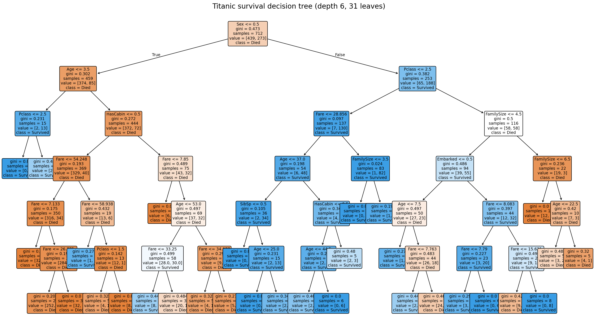
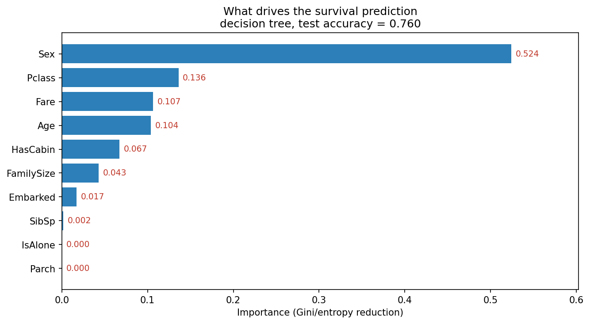

# Findings

Every number here comes from running titanic_decision_tree.py on an 80/20 stratified split
(712 training rows, 179 test rows, seed 42). The test numbers are on passengers the model never saw
while training or tuning.

In short, survival on the Titanic came down mostly to who you were, not what you did. Sex decides
most of it, and passenger class, fare and age fill in the rest. The tuned tree gets about 76% of
unseen passengers right.

## 1. What did the data look like?

891 passengers, 12 columns, with Survived as the 0/1 target. About 38% of passengers survived, so
the classes are moderately imbalanced. Three columns had gaps: Cabin was missing for 687 passengers
(77%), Age for 177 (20%) and Embarked for 2. Cabin was too sparse to use directly, so I turned it
into a single yes/no flag and dropped the rest.

## 2. How was it preprocessed?

I dropped the three identifier columns (PassengerId, Name, Ticket), built HasCabin from Cabin before
dropping Cabin, filled Age with its median (28.0) and Embarked with its mode (S), and added
FamilySize (SibSp + Parch + 1) and IsAlone. Sex and Embarked were encoded as small integers. That
leaves ten features: Pclass, Sex, Age, SibSp, Parch, Fare, Embarked, HasCabin, FamilySize and
IsAlone.

## 3. What is the best tree?

A 5-fold grid search over depth, leaf size and split criterion picked gini, max_depth = 6 and
min_samples_leaf = 5, scoring 0.8231 in cross-validation. The final tree has 31 leaves. Its first
split is on Sex, which already separates most survivors from non-survivors.

## 4. How accurate is it?

On the 179 held-out passengers:

| Metric | Value |
|--------|------:|
| Accuracy | 0.760 |
| Precision (Survived) | 0.771 |
| Recall (Survived) | 0.536 |
| F1 (Survived) | 0.633 |

The cross-validation accuracy (0.82) sits a few points above the test accuracy (0.76). That is what
you would expect, since the grid search tunes on the training folds and a small drop on truly unseen
data is normal.

## 5. Where does it get things wrong?

Confusion matrix on the test set:

| | predicted Died | predicted Survived |
|---|---:|---:|
| **actual Died** | 99 | 11 |
| **actual Survived** | 32 | 37 |

The tree is much better at identifying passengers who died (recall 0.90) than those who survived
(recall 0.54). It misses 32 of the 69 real survivors. When it does predict "survived" it is usually
right (precision 0.77). With more deaths than survivals in the data, the tree leans toward the
majority "died" label, and that is where most of its mistakes come from.

## 6. What drove the predictions?

Feature importances, high to low:

| Feature | Importance |
|---------|-----------:|
| Sex | 0.524 |
| Pclass | 0.136 |
| Fare | 0.107 |
| Age | 0.104 |
| HasCabin | 0.067 |
| FamilySize | 0.043 |
| Embarked | 0.017 |
| SibSp | 0.002 |
| Parch | 0.000 |
| IsAlone | 0.000 |

Sex alone accounts for more than half of the tree's decisions and is the first split, with being
female pushing strongly toward "survived". Passenger class, fare and age together make up another
third, and all three stand in for wealth and where on the ship a passenger was likely berthed.
HasCabin adds a little more, since a recorded cabin usually meant a paying, higher-deck passenger.
The family-count features do very little here. IsAlone and Parch are not used at all, because
FamilySize already captures most of that signal.

## 7. Do the results look sensible?

Yes. "Women and higher-class passengers first" is the well-known pattern of the Titanic evacuation,
and the tree lands on the same thing: sex first, then class and fare. The one caveat is the low
survivor recall. The model is cautious about predicting survival, so it should not be read as
equally reliable in both directions.

See DECISIONS.md for the choices behind this and data_dictionary.md for the columns.
